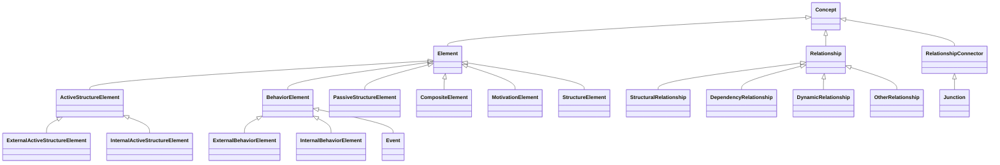

# Architecture Overview

This page provides a high-level map of the etcion codebase and its class
hierarchy.  For full API details see the [API Reference](../api/index.md).

## Module Map

| Module | Responsibility |
|--------|---------------|
| `metamodel/concepts.py` | Root ABCs: Concept, Element, Relationship |
| `metamodel/elements.py` | Abstract element hierarchy (ActiveStructure, Behavior, etc.) |
| `metamodel/business.py` | Business layer concrete elements |
| `metamodel/application.py` | Application layer concrete elements |
| `metamodel/technology.py` | Technology layer concrete elements |
| `metamodel/physical.py` | Physical layer concrete elements |
| `metamodel/strategy.py` | Strategy layer concrete elements |
| `metamodel/motivation.py` | Motivation layer concrete elements |
| `metamodel/implementation_migration.py` | Implementation & Migration layer elements |
| `metamodel/relationships.py` | All 11 relationship types + Junction |
| `metamodel/model.py` | Model container, QueryBuilder |
| `metamodel/viewpoints.py` | Viewpoint, View, Concern |
| `metamodel/viewpoint_catalogue.py` | Predefined viewpoint definitions |
| `metamodel/profiles.py` | Profile, Specialization, extended attributes |
| `metamodel/notation.py` | NotationMetadata |
| `metamodel/mixins.py` | Shared mixins |
| `validation/permissions.py` | Appendix B permission table, `is_permitted()` |
| `validation/rules.py` | ValidationRule base |
| `derivation/engine.py` | DerivationEngine |
| `serialization/xml.py` | XML serialization (Exchange Format) |
| `serialization/json.py` | JSON serialization |
| `serialization/registry.py` | Type registry for deserialization |
| `comparison.py` | `diff_models()`, ModelDiff, ConceptChange |
| `conformance.py` | ConformanceProfile |
| `enums.py` | Layer, Aspect, AccessMode, etc. |
| `exceptions.py` | PyArchiError hierarchy |

## Class Hierarchy

The diagram below shows the core type hierarchy to two levels of depth.
Concrete layer-specific elements (e.g. `BusinessActor`, `ApplicationComponent`)
inherit from the abstract nodes shown here -- see the
[Elements API reference](../api/elements.md) for the full taxonomy.

!!! tip "Reading the diagram"
    - **Element** subtypes map to the ArchiMate aspect classification
      (active structure, behavior, passive structure).
    - **Relationship** subtypes follow the specification's four relationship
      categories.
    - **RelationshipConnector** contains only `Junction`, used to combine
      relationships.
